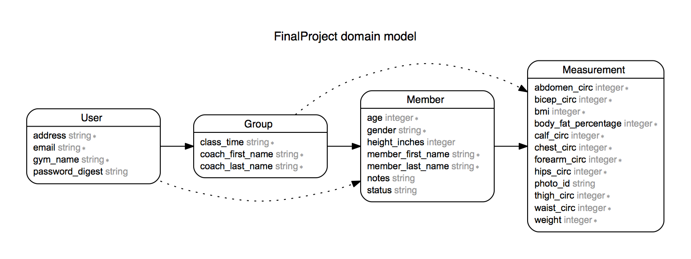

#Total Body Data

As the owner/operator of a gym, my sister tracks measurements of her members as they progress towards their fitness goals. The current process of gathering and logging this data has a very 1995 feel to it. Take measurement, jot down number, lock away in boring excel spreadsheet. But what if that data has a story to tell? Total Body Data allows gym staff to quickly and efficiently add members and log member data from any device. This data is immediately available in graphical form for quick visual feedback on individual member progress and overall membership growth. Are members progressing as they should be? Does our marketing/sales strategy need work? Total Body Data keeps gyms informed and makes data-driven decision making a breeze.

##Nav Bar
Quick navigation via user-friendly nav bar

##Measurement Quick-Add
Add measurements quickly from any device

##Member Profiles
Get quick visual feedback on gym member progress

